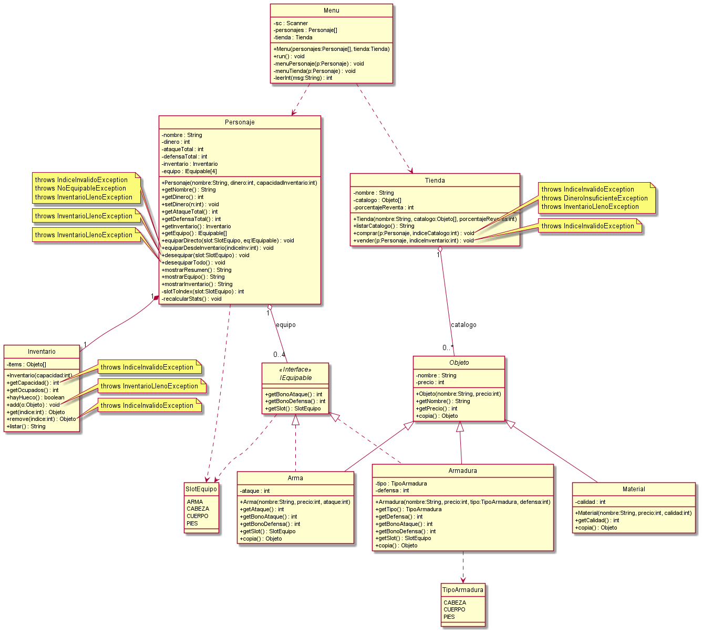

# RPG de Consola (FP2) — Inventario, Equipo y Tienda

## Conceptos POO cubiertos

| Concepto | Dónde se aplica |
|----------|-----------------|
| **Clase abstracta** | `Objeto` - define estructura común |
| **Método abstracto** | `Objeto.copia()`, `Objeto.toString()` |
| **Herencia** | `Arma`, `Armadura`, `Material` extienden `Objeto` |
| **Interface** | `IEquipable` - contrato para equipamiento |
| **Polimorfismo** | `Tienda.comprar()` llama `obj.copia()` sin saber el tipo |
| **instanceof** | `Personaje.equiparDesdeInventario()` verifica tipo |
| **Composición** | `Personaje` crea y posee `Inventario` |
| **Agregación** | `Tienda` recibe array externo |
| **Constantes (final)** | `Config` - clase final con constructor privado |
| **Enum** | `SlotEquipo`, `TipoArmadura` |
| **Arrays con huecos** | `Inventario`, `Personaje.equipo[]` - gestión de `null` |
| **Excepciones propias** | 5 excepciones de dominio |
| **Encapsulación** | Campos privados + getters/setters |
| **Override toString()** | Todas las clases de dominio |

---

## Restricciones

- **No** `break` / `continue` en bucles
- **No** múltiples `return` por método
- **No** colecciones (`ArrayList`, `HashMap`). Solo arrays
- `instanceof` solo para verificar `IEquipable`
- Input simple: si hay error, se informa y vuelve al menú

---

## Ficheros

> Los ficheros son **autocontenidos**: cada línea tiene todos los datos para crear el objeto.

### `tienda.txt`

```
ARMA;Nombre;Precio;Ataque
ARMADURA;Nombre;Precio;TipoArmadura;Defensa
MATERIAL;Nombre;Precio;Calidad
```

### `personajes.txt`

```
PERSONAJE;Nombre;Dinero;CapacidadInventario
EQUIPO;VACIO;SlotEquipo
EQUIPO;ARMA;Nombre;Precio;Ataque
EQUIPO;ARMADURA;Nombre;Precio;TipoArmadura;Defensa
INV;ARMA;Nombre;Precio;Ataque
INV;MATERIAL;Nombre;Precio;Calidad
FIN
```

`FIN` obligatorio por cada personaje.

## Diagrama de clases


